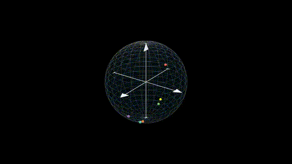
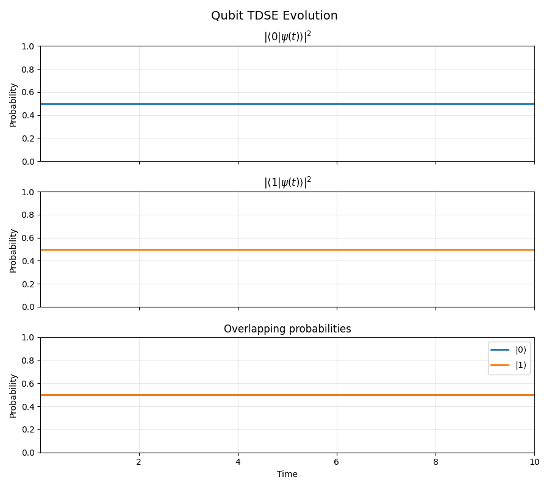
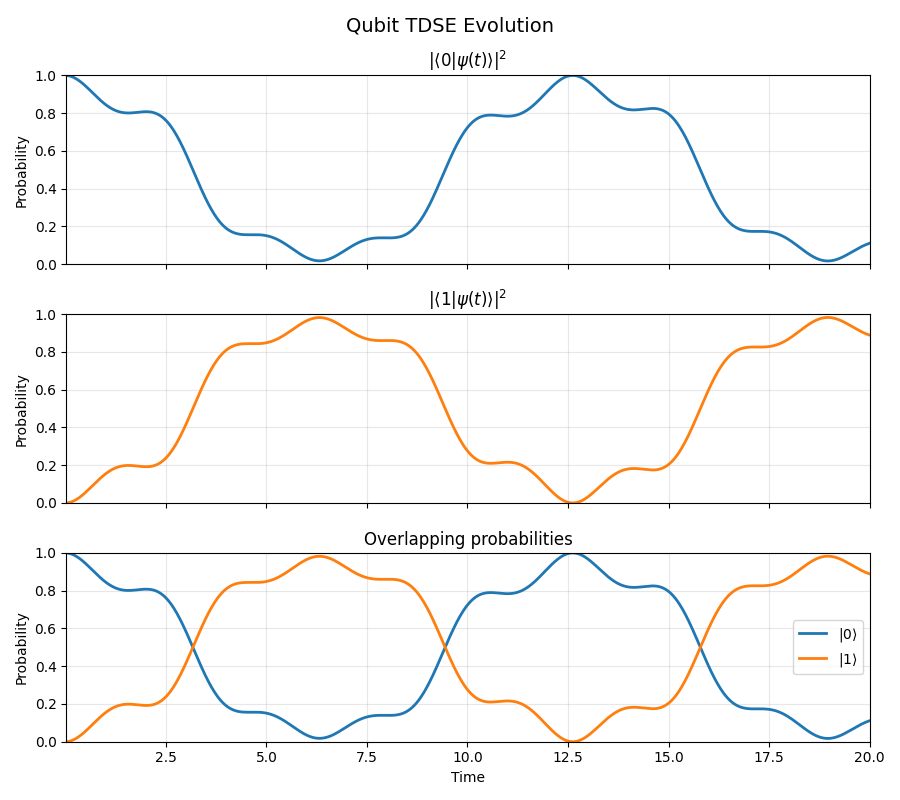
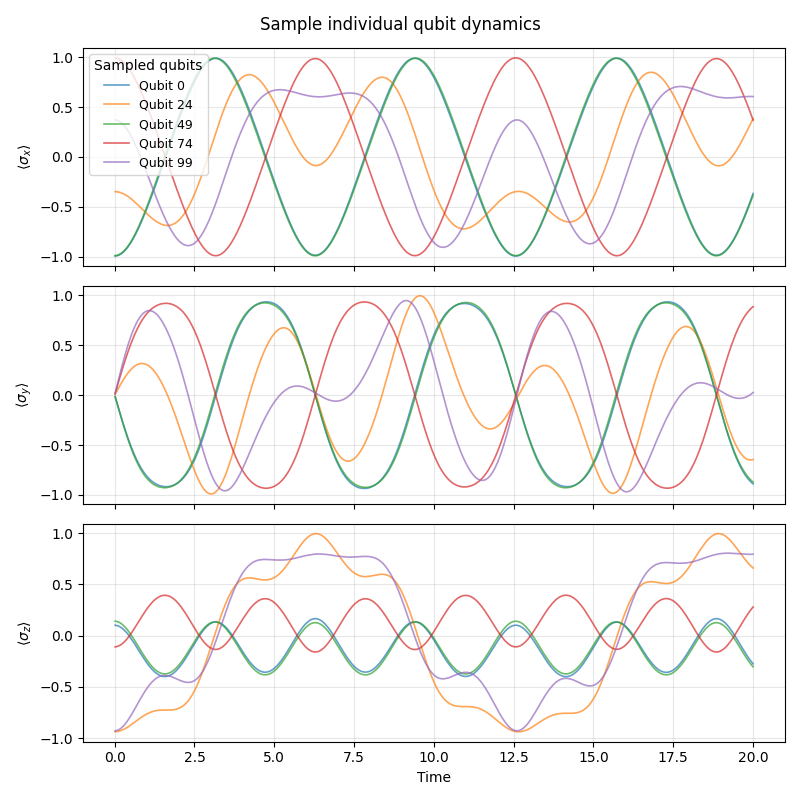

# Time-Dependent Schrödinger Equation Simulator for Qubit Dynamics

This project is a Python-based simulator for studying **static and driven qubit dynamics** by numerically solving the **time-dependent Schrödinger equation (TDSE)**.
It focuses on clean physics modeling, modular numerical solvers, and clear visualization of quantum dynamics.

The simulator supports:

* static qubits (time-independent Hamiltonians)
* driven qubits (time-dependent control fields)
* probability evolution
* Bloch-sphere representations of qubit states

---

## Overview

The core idea is simple:

1. Define a qubit Hamiltonian (static or driven)
2. Solve the TDSE numerically
3. Visualize how the quantum state evolves in time

The project uses:

* **JAX** for fast numerical computation
* **Matplotlib** for analysis and probability plots
* **Manim** for high-quality Bloch-sphere animations (demonstrations)

---

## Mathematical Model

The qubit is modeled as a two-level quantum system with state

$$
|\psi(t)\rangle =
\begin{pmatrix}
c_0(t) \\
c_1(t)
\end{pmatrix}
$$

whose time evolution is governed by the time-dependent Schrödinger equation (TDSE)

$$
i\hbar \frac{d}{dt} |\psi(t)\rangle = H(t)\|\psi(t)\rangle.
$$

### Static Qubit

For a static qubit, the Hamiltonian is time-independent:

$$
H = \frac{\omega}{2}\\sigma_z
$$

This Hamiltonian produces pure phase evolution with no population transfer between the basis states.
On the Bloch sphere, the state vector precesses around the $z$-axis.

### Driven Qubit

For a driven qubit, an external time-dependent control field is applied:

$$
H(t) =
\frac{\omega}{2}\\sigma_z
+
\Omega \cos(\omega_d t)\\sigma_x
$$

where:
- $\omega$ is the qubit transition frequency
- $\Omega$ is the drive amplitude
- $\omega_d$ is the drive frequency

This time-dependent Hamiltonian induces coherent transitions between the qubit states, leading to
Rabi oscillations and nontrivial Bloch-sphere dynamics.


## Running the Matplotlib Simulations

These scripts numerically solve the TDSE and produce **probability plots**.

### Static qubit

```bash
python static_qubit.py
```

This shows:

* constant state probabilities
* phase evolution without population transfer

---

### Driven qubit

```bash
python driven_qubit.py
```

This shows:

* time-dependent population transfer
* Rabi oscillations between the qubit states

These plots are useful for **analysis, debugging, and verification of the physics**.

### Multi Single-Driven qubit

```bash
python batch_qubit.py
```
The batch results are visualized using:

* Time-domain expectation values $\langle \sigma_x \rangle$, $\langle \sigma_y \rangle$, and $\langle \sigma_z \rangle$
* Bloch-sphere animations showing multiple sampple qubits evolving simultaneously

These visualizations highlight how coherent single-qubit dynamics give rise to nontrivial ensemble behavior due to phase dispersion, even in the absence of decoherence.


---

## Bloch-Sphere Demonstrations

### Driven qubit

<p align="center">
  
</p>

### Static qubit

<p align="center">
  
</p>

### Batch Driven qubits

<p align="center">
  
</p>

The Bloch-sphere animations provide an intuitive geometric picture of the qubit dynamics and are generated using **Manim** for presentation-quality visualization.

---

## Results (Matplotlib)

The Matplotlib simulations demonstrate the expected behavior of two-level quantum systems.

### Static qubit

* Constant populations
* Bloch vector precessing around the z-axis
* Pure phase evolution

<p align="center">
  
</p>

---

### Driven qubit

* Population transfer between $|0\rangle$ and $|1\rangle$
* Rabi oscillations
* Strong dependence on drive amplitude and frequency

<p align="center">
  
</p>

These results are consistent with the standard physics of driven two-level systems.

### Multi Single-Driven qubit
## Ensemble mean: mathematics

<p align="center">
  
</p>

For a batch of $N$ qubits, the expectation value of a Pauli operator $\sigma_i$ for the $k$-th qubit is

$$
\langle \sigma_i \rangle_k(t) = \langle \psi_k(t) | \sigma_i | \psi_k(t) \rangle, \quad i \in \{x, y, z\}
$$

The **ensemble-averaged expectation value** is defined as

$$
\overline{\langle \sigma_i \rangle}(t) = \frac{1}{N} \sum_{k=1}^{N} \langle \sigma_i \rangle_k(t)
$$

The ensemble-averaged Bloch vector is therefore

$$
\overline{\mathbf{r}}(t) = \left( \overline{\langle \sigma_x \rangle}(t), \overline{\langle \sigma_y \rangle}(t), \overline{\langle \sigma_z \rangle}(t) \right)
$$

Importantly, the reduction in the magnitude of the ensemble-averaged Bloch vector arises from **phase cancellation between qubits**, not from decoherence. Each individual qubit remains in a pure state throughout the evolution.


<p align="center">
  
</p>

This figure shows individual qubit expectation values for $\langle \sigma_x \rangle$, $\langle \sigma_y \rangle$, and $\langle \sigma_z \rangle$ for a small sample drawn from the ensemble. All qubits evolve coherently under the same driven Hamiltonian, exhibiting identical frequencies but different phases due to distinct initial states. The absence of damping confirms unitary, norm-preserving evolution, while phase dispersion across the ensemble explains the reduction observed in ensemble-averaged quantities.

### Subtle but important insight

From this plot alone, you can already infer:

* the drive strength is moderate (not RWA-clean)
* counter-rotating effects are present
* dynamics are coherent but not trivial

---

## Notes

* The numerical solver uses a fourth-order Runge–Kutta (RK4) method.
* The solver is modular and extensible for additional systems.
* The project is designed for learning, exploration, and visualization rather than production-level quantum simulation.

---
